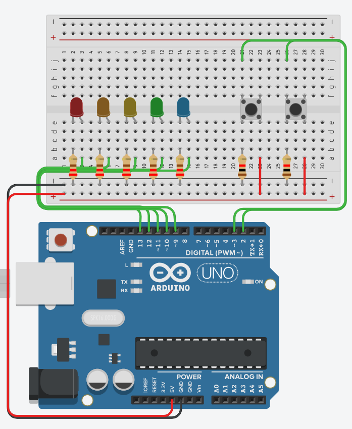

### 🚀 Arduino Challenge: LED Sequencing with Buttons & Serial Input

#### **Task:**  
You have an **Arduino Uno** connected to a breadboard with **five LEDs** and **two push buttons**. Your goal is to write a program that follows these conditions:

1. When **button 1** is pressed, the LEDs should turn **on one by one** in a sequence, with a **200ms delay** between each.
2. When **button 2** is pressed, the LEDs should turn **off one by one** in reverse order, also with a **200ms delay** between each.
3. If **neither button is pressed**, the LEDs should stay in their current state.
4. The system should also accept **serial commands** to:
   - Turn all LEDs **on** or **off** immediately.
   - Change the delay timing dynamically.
   - Start or stop an **automatic sequence** where LEDs turn on and off in a loop.

---

#### **Requirements:**
✅ Use a **for loop** to control the LEDs.  
✅ Use a **function** to handle turning LEDs on and off.  
✅ Use **variables** to store the LED and button pin numbers.  
✅ Use **conditions** (`if` statements) to check button states.  
✅ Implement **serialEvent()** to read **strings, ints, and floats** from the Serial Monitor.  
✅ Implement a **finite state machine (FSM)** to manage different operating modes (manual, auto, serial control).  

---

#### **🎨 Bonus Challenge:**  
Modify your program so that:
- Holding **button 1** continuously will cause the LEDs to repeat the sequence **in a loop**, and holding **button 2** will do the same but in reverse.
- The Serial Monitor can be used to adjust brightness (if using PWM-capable pins) or set a custom LED pattern.

---

#### **👉 Hint:**  
Use `digitalRead()` to check the button state and `digitalWrite()` to control the LEDs. The `delay()` function will help you create the necessary timing. Use `serialEvent()` to handle incoming serial data asynchronously. Implement a **state variable** to track the system’s mode and respond accordingly.

Good luck! 🚀

