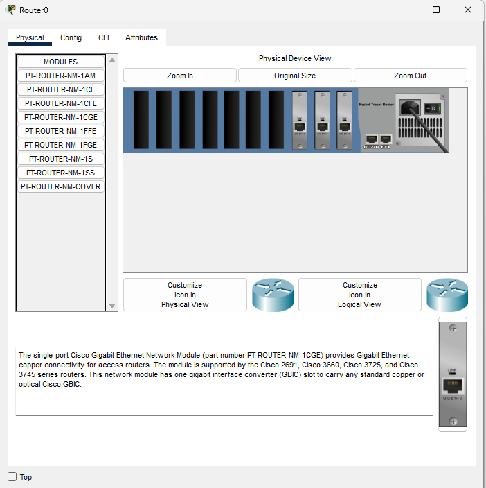

# Static Routing Tables 

Consider the following network:



[download](assets/tldr.static.routing.table.initial.pkt)

## Configuring the simulation

Let's configure all of the routers

### Router0: 

Port | IP Address
-- | --
G0/0 | 10.10.10.1/24
G0/1 | 10.10.11.1/24


### Router 1

Port | Address
-- | --
G0/0 | 10.10.11.2/24
G0/1 | 10.10.13.1/24


### Router 2

Port | Address
-- | --
G0/0 | 10.10.12.2/24
G0/1 | 10.10.13.2/24


### Router 3

Port | Address
-- | --
G0/0 | 10.10.10.2/24
G0/1 | 10.10.12.1/24


## Testing (and failing) on the network

Let's hop on to Router0 and test how far we can ping on the network

```
Router>show ip interface brief
Interface              IP-Address      OK? Method Status                Protocol 
GigabitEthernet0/0     10.10.10.1      YES manual up                    up 
GigabitEthernet0/1     10.10.11.1      YES manual up                    up 
Vlan1                  unassigned      YES unset  administratively down down
Router>ping 10.10.10.1

Type escape sequence to abort.
Sending 5, 100-byte ICMP Echos to 10.10.10.1, timeout is 2 seconds:
!!!!!
Success rate is 100 percent (5/5), round-trip min/avg/max = 2/8/29 ms

Router>ping 10.10.10.2

Type escape sequence to abort.
Sending 5, 100-byte ICMP Echos to 10.10.10.2, timeout is 2 seconds:
!!!!!
Success rate is 100 percent (5/5), round-trip min/avg/max = 0/0/0 ms

Router>ping 10.10.12.1

Type escape sequence to abort.
Sending 5, 100-byte ICMP Echos to 10.10.12.1, timeout is 2 seconds:
.....
Success rate is 0 percent (0/5)
```

So, why can't I ping 10.10.12.1? Aren't the routers connected? 

Yes they are, but they need to be told where other IP addresses are and if they are supposed to route to them. 


## Routing Tables 

### Router0

```
Router0# configure terminal
Router0(config)# ip route 10.10.12.0 255.255.255.0 10.10.10.2
Router0(config)# ip route 10.10.13.0 255.255.255.0 10.10.11.2
Router0(config)# exit
```

### Router1

```
Router1# configure terminal
Router1(config)# ip route 10.10.11.0 255.255.255.0 10.10.10.1
Router1(config)# ip route 10.10.13.0 255.255.255.0 10.10.12.2
Router1(config)# exit
```

### Router2

```
Router2# configure terminal

Router2(config)# ip route 10.10.10.0 255.255.255.0 10.10.11.1

Router2(config)# ip route 10.10.12.0 255.255.255.0 10.10.13.2

Router2(config)# exit
```

### Router3

```
Router3# configure terminal

Router3(config)# ip route 10.10.10.0 255.255.255.0 10.10.12.1

Router3(config)# ip route 10.10.11.0 255.255.255.0 10.10.13.1

Router3(config)# exit
```

### Showing routes 

```
Router(config)# exit
Router# show ip route
```

